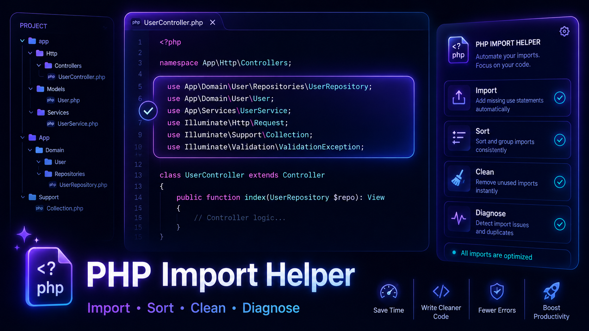

# PHP Import Helper

[](https://marketplace.visualstudio.com/items?itemName=vix.php-import-helper)
[](https://marketplace.visualstudio.com/items?itemName=vix.php-import-helper)
[](https://marketplace.visualstudio.com/items?itemName=vix.php-import-helper)


VS Code extension for PHP imports and namespaces. It resolves classes from the workspace, adds and expands imports, sorts and folds `use` blocks, removes unused imports, generates namespaces from Composer autoload config, and reports import diagnostics.



## Features

- Import one class from the cursor or diagnostic quick fix.
- Import all uniquely resolved classes in the active PHP file.
- Expand a short class name to a fully qualified class name.
- Sort imports by natural order, length, or alphabetically.
- Fold top-level import blocks, including grouped, function, and const imports.
- Remove unused class imports while preserving PHPDoc-only usages, aliases, traits, and namespace-prefix usages.
- Generate namespaces from the nearest `composer.json` PSR-4/PSR-0 mapping.
- Highlight unimported classes and unused imports with quick fixes.
- Cache namespace indexes on activation and update them through PHP file watchers.

## Commands

| Command | Title |
| --- | --- |
| `phpImportHelper.import` | Import Class |
| `phpImportHelper.importAll` | Import All Classes |
| `phpImportHelper.expand` | Expand Class |
| `phpImportHelper.sort` | Sort Imports |
| `phpImportHelper.foldUses` | Fold Imports |
| `phpImportHelper.removeUnused` | Remove Unused Imports |
| `phpImportHelper.generateNamespace` | Generate Namespace |
| `phpImportHelper.rebuildIndex` | Rebuild Namespace Index |
| `phpImportHelper.showPerformanceStats` | Show Performance Stats |

## Settings

```jsonc
{
    "phpImportHelper.index.exclude": [
        "**/.git/**",
        "**/node_modules/**",
        "**/vendor/**",
        "**/var/cache/**",
        "**/runtime/**",
        "**/storage/framework/**",
        "**/bootstrap/cache/**"
    ],
    "phpImportHelper.autoSort": true,
    "phpImportHelper.autoFoldUses": false,
    "phpImportHelper.sortOnSave": false,
    "phpImportHelper.sortMode": "natural",
    "phpImportHelper.leadingSeparator": true,
    "phpImportHelper.removeOnSave": false,
    "phpImportHelper.autoImportOnSave": false,
    "phpImportHelper.ignoreList": [],
    "phpImportHelper.highlightNotImported": true,
    "phpImportHelper.highlightNotUsed": true,
    "phpImportHelper.diagnostics.debounceMs": 300,
    "phpImportHelper.performance.trace": false
}
```

## Development

```sh
npm run lint
npm run check-types
npm run package
npm run test:unit
npm run test:integration
```
